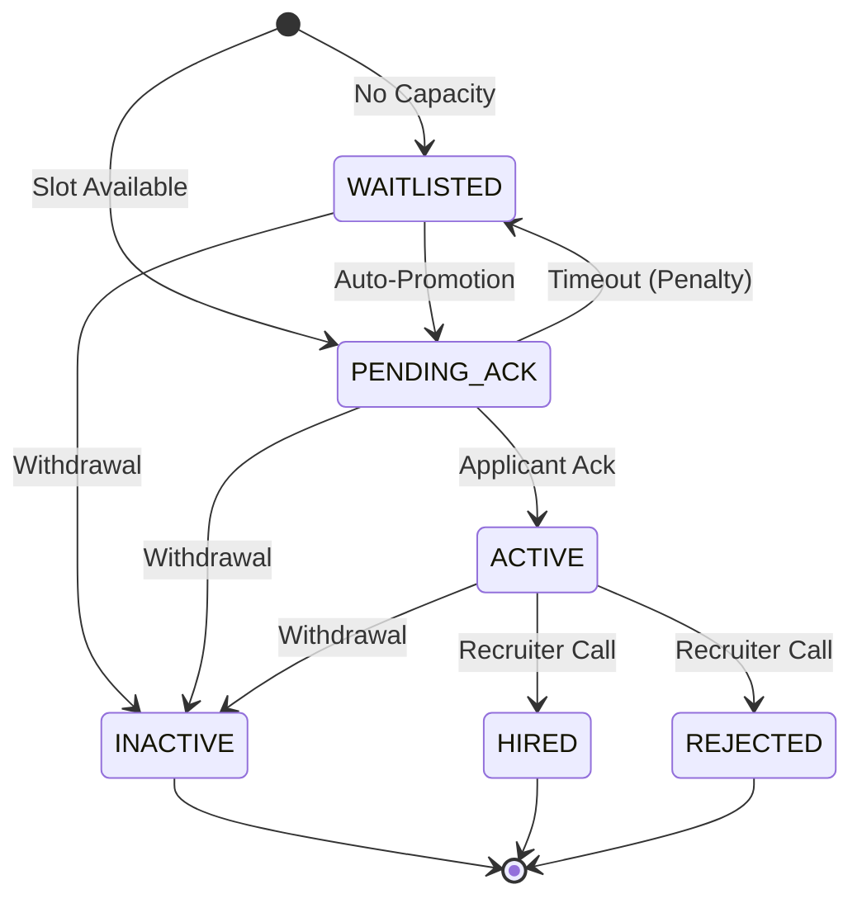

# Queue-Based Hiring Pipeline ATS (Elite Version)

A high-performance, transactionally-safe Applicant Tracking System (ATS) designed for high-concurrency environments. Built with **TypeScript, Node.js, and PostgreSQL**, this system solves the "simultaneous application" problem using pessimistic locking and automatic promotion cascades.

---

## 🎯 Engineering Highlights (The 1% Signal)

### 1. Proof of Concurrency (Atomic Operations)
Most systems fail when two users apply for the last slot at the same microsecond. This system uses **PostgreSQL Row-Level Locking (`SELECT FOR UPDATE`)** to guarantee correctness:
- **Scenario**: 2 applications, 1 slot.
- **Transaction A** locks the `job` row.
- **Transaction B** is blocked, waiting for the lock.
- **Transaction A** sees capacity available → Inserts `PENDING_ACK`. Commits.
- **Transaction B** acquires lock → Sees capacity is now full → Inserts `WAITLISTED`.
- **Outcome**: Zero race conditions. No over-capacity.

### 2. Reliable Transitions (State Machine)
We use a centralized `stateMachine.ts` to enforce valid state changes. No application can "jump" states (e.g., from `WAITLISTED` to `HIRED`) without going through the proper pipeline.



### 3. Automatic Recovery (Failure Scenarios)
- **Server Crashes mid-promotion?** All status changes are wrapped in atomic transactions. If the server dies before `COMMIT`, the database rolls back, and the applicant stays in their previous state. No lost applications.
- **Worker fails?** The `decayWorker` uses `FOR UPDATE SKIP LOCKED`. Multiple worker instances can run in parallel; they skip already-locked rows, preventing double-processing.

---

## 🏗️ Architectural Tradeoffs (The "Why")

| Decision | Why? | Tradeoff |
|----------|------|----------|
| **PostgreSQL vs Redis** | Redis is fast but non-transactional for complex state. Postgres provides ACID compliance and persistent locking guarantees. | Slightly higher latency (~5ms) compared to in-memory. |
| **Polling vs Event-Driven** | Avoids the complexity of BullMQ/Redis. Simplifies deployment to a single DB + Server. | Small delay (max interval) in processing expirations. |
| **Pessimistic Locking** | Prevents race conditions at the source. | Slight blocking of concurrent writes on the *same* job. |

---

## 📡 Observability (Metrics & API)

This system provides a dedicated **Metrics Endpoint** for real-time monitoring:
`GET /jobs/:id/metrics`

Returns:
- **Utilization**: Real-time slot occupancy percentage.
- **Decay Frequency**: How often candidates fail to acknowledge (signals pipeline friction).
- **Avg Wait Time**: Historical data on how long applicants stay waitlisted.
- **Stall Marker**: Detects if a job has open slots but a static waitlist (indicates promotion failure).

---

## 🛠️ Setup & Running

### Prerequisites
- Node.js 18+
- PostgreSQL 14+
- `.env` file (see `.env.example`)

### 1. Installation
```bash
cd server
npm install
```

### 2. Start Services
```bash
# Start the TypeScript backend
npm run dev
```

### 3. Verification Commands
```bash
# Check Metrics for a job
curl http://localhost:3001/jobs/{job_id}/metrics

# Health Check
curl http://localhost:3001/health
```

---

## 🚀 Future Production roadmap
1. **Durable Workers**: Replace `setInterval` with a distributed task scheduler if scaling > 100k jobs.
2. **Notification Layer**: Add WebHooks/SNS to notify applicants of status changes.
3. **Advanced Audit**: Implement Change Data Capture (CDC) for logs to keep transactions lighter.

---

**Built for performance, scalability, and extreme reliability.**
