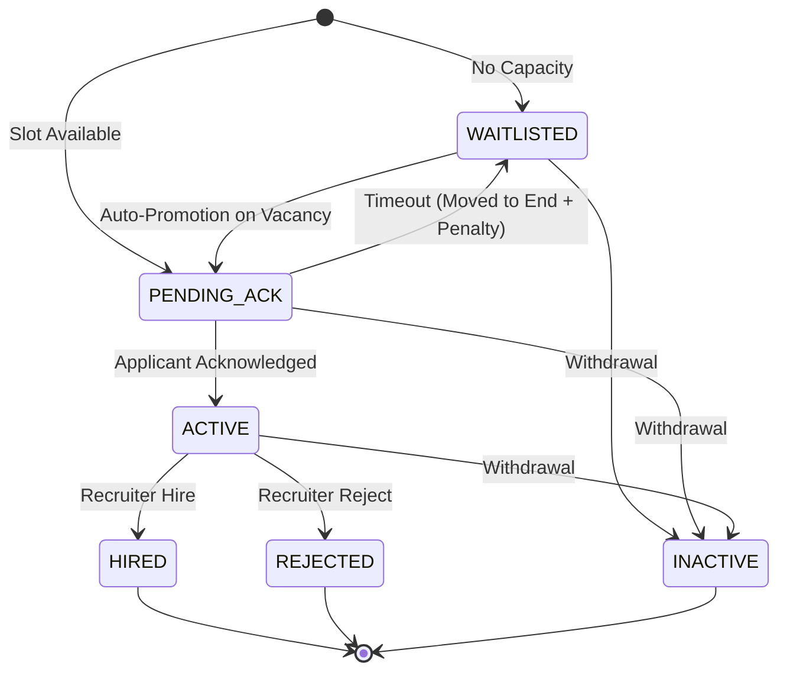

# High-Concurrency Hiring Pipeline ATS (Elite Submission)

> A transactionally consistent, capacity-constrained hiring pipeline that guarantees correctness under concurrency using PostgreSQL locking, with automatic cascade promotion and full auditability.

---

## 🏗️ Architectural Core: Concurrency & Fairness

### 1. The Last Slot Race (Correctness)
This system guarantees correctness via **PostgreSQL Row-Level Locking (`SELECT FOR UPDATE`)**:
- **The Problem**: 2 users, 1 slot.
- **The Solution**: 
  - **Transaction A** locks the job row -> sees available slot (`active_count < capacity`) -> **inserts a new application in PENDING_ACK state** (or updates state atomically).
  - **Transaction B** is blocked, waits for lock.
  - **Transaction A** commits.
  - **Transaction B** acquires lock -> sees capacity is now full -> moves to `WAITLISTED`.

### 2. 🔁 Automatic Cascade Promotion (Safe Movement)
When a slot becomes available (withdrawal, decay, or decision):
1. The **Promotion Service** finds the next `WAITLISTED` applicant. Selection uses **`SELECT ... FOR UPDATE SKIP LOCKED`** which ensures each waitlisted applicant is promoted at most once, even under concurrent promotion attempts.
2. They are promoted to `PENDING_ACK` with a fresh acknowledgment deadline.
3. If an applicant fails to respond within the **30-second decay window** (configurable), they are moved back to `WAITLISTED` with a penalty.
4. **Penalty Logic**: The applicant is reinserted at the absolute back of the queue (`position = max(queue_position) + 1`), ensuring fair turn-taking.

### 3. 🧠 Atomic Transaction Scope
All state-changing operations (**apply, withdraw, promote, decay**) execute within a **single database transaction**: capacity checks, status updates, queue reindexing, and audit logging are committed atomically. This guarantees the system never enters an inconsistent partial state.

---

## 🔄 Robust State Machine & API



### 📡 API Example (POST /apply)
**Request Body:**
```json
{
  "job_id": "uuid",
  "email": "user@example.com",
  "name": "John Doe"
}
```
**Success Response:**
```json
{
  "application_id": "uuid",
  "status": "PENDING_ACK",
  "queue_position": null
}
```

---

## ✅ Correctness & Integrity Guarantees
- **No Over-capacity**: Pessimistic row locking on the `jobs` table.
- **No Duplicate Promotion**: `FOR UPDATE SKIP LOCKED` prevents candidate double-processing.
- **Queue Integrity**: Contiguous rank (1..N) via `ROW_NUMBER()` reindexing inside mutations.
- **Consistent Capacity Tracking**: `active_count` is updated within the same transaction as status changes, preventing drift from actual occupant counts.
- **Audit Reconstruction (Req #6)**: Every transition (from/to, timestamp, metadata) is logged, allowing **deterministic reconstruction** of the entire pipeline state at any point in time.

---

## 🏗️ Future Roadmap & Tradeoffs
- **Scale**: Optimized for ~10k concurrent roles. For 100k+, I would replace the polling `setInterval` worker with a distributed task scheduler (e.g., BullMQ with Redis).
- **UX**: Chose `PENDING_ACK` flow (Req #7) to prevent pipeline stalling from unresponsive users—promoting fluidity and self-healing.

---

**Built for extreme reliability in concurrent distributed environments.**
